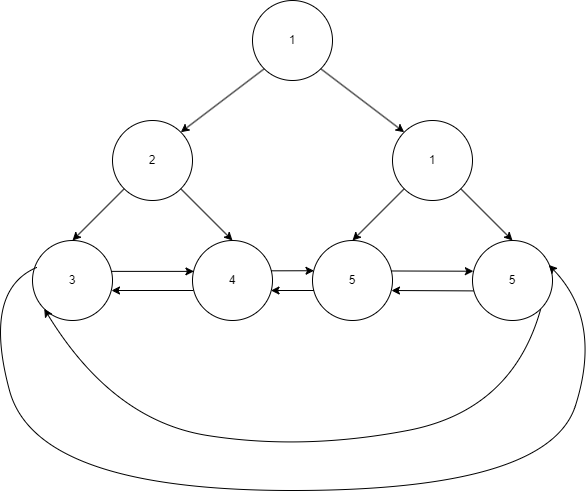

# [Aurva](https://aurva.io/)

## Details

### Job Status

> Full Time (Employment + Internship Mandatory)

### Criteria

| Study | Cutoff |
|-------|--------|
| X     | %      |
| XII   | %      |
| UG    | 8 GPA  |

[comment]: # (Any other details go under this. This is a comment)

- 8 GPA or OpenSource contributor

### Compensation

|        | FTE     | Internship |
|--------|---------|------------|
| Base   | 1400000 | 30000      |
| Stocks | 200000  | --         |
| Bonus  | --      | --         |
| CTC    | 1600000 | --         |

[comment]: # (Details about the rounds go under this comment.)

- Lunch / Dinner provided at office.

## Round 1

> 14/10/23

[comment]: # (Summary of the sections and experience below this comment.)

The test was not on any platform, rather a document was provided and we were asked to code it locally and upload it to google drive and share them the link.

### Coding Questions

1. **[Parking Slots](https://www.lintcode.com/problem/919)**: A parking lot has a number of parking slots. It also maintains a register which contains the entry and exit times of the cars using the parking slots.

    Given the register entries as input, determine the minimum number of slots that the parking lot should have to accommodate the cars.

    The entry array and exit array are index based. The 1st index indicates when the 1st car entered and exited and so on.

    > Note: if there is an entry and exit at the same time we are counting that as a slot being free.

    Example:
    ```
    Input:
    Entry = [1, 3, 4, 5]
    Exit = [2, 5, 6, 7]

    Output:
    2
    ```

[comment]: # (Add any resources or links or code to this question under this comment.)

```cpp
int solve(vector<int>& entry, vector<int>& ex, int n) {
    if (n == 0) {
        return 0;
    }
    if (n == 1) {
        return 1;
    }
    sort(entry.begin(), entry.end());
    sort(ex.begin(), ex.end());
    int overlaps = 0, count = 0;
    
    int start = 0, end = 0;
    // Basically have to check the number of overlapping intervals
    while (start < n && end < n) {
        // if the start of the running interval is less than the end of the next one, we need a slot.
        if (entry[start] < ex[end]) {
            ++start;
            ++count;
        }
        // otherwise that slot has been used and then we don't need it anymore.
        else {
            ++end;
            --count;
        }
        // at any point in time we keep track of the maximum number of slots required.
        overlaps = max(overlaps, count);
    }
    return overlaps;
}
```

---

2. **Leaf Nodes**: A binary tree is given where leaf nodes ar interconnected through left and right pointers, with right leaf nodes linked through right pointers and left leaf nodes connected through left pointers.

    Find out all the leaf nodes that the tree is having.

    

    Example:
    ```
    Input:
    Pointer to root node

    TreeNode {
        int val;
        TreeNode *left;
        TreeNode *right;
    }
    
    Output:
    [3, 4, 5, 5] (Order doesn't matter)
    ```

[comment]: # (Add any resources or links or code to this question under this comment.)

---

3. **Balanced Subarray**: Aurva has n servers lined up in a row. The ith server has the capacity of capacity[i].

    Any application can be deployed on a balanced contiguous subsegment of 3 or more servers. A contiguous segment, `[l, r]` of servers is said to be balanced if `capacity[l] = capacity[r] = sum(capacity[l + 1]...capacity[r - 1])` i.e. the capacity of the servers at the endpoints of the segment should be equal to the sum of the capacity of all the interior servers.

    Given the capacity of each server in a row, find the number of balanced sub-segments in it.

    Example:
    ```
    [(9, 3, 3, 3, 9)] == 2
    (9, 3, 3, 3, 9) and (3, 3, 3) sub-array satisfies the criteria

    [(6, 1, 2, 3, 6)] == 1
    (6, 1, 2, 3, 6) satisfies the criteria

    [(9, 3, 1, 2, 3, 9, 10)] == 2
    (9, 3, 1, 2, 3, 9) and (3, 1, 2, 3) satisfies the criteria
    ```

[comment]: # (Add any resources or links or code to this question under this comment.)

```cpp
int solve(vector<int>& arr) {
    if (arr.size() < 3) {
        return 0;
    }
    int n = arr.size();
    vector<int> prefix(n, 0);
    prefix[0] = arr[0];

    // Maintain a prefix sum for finding the sum of a contigious subarray quickly
    for (int i = 1; i < n; ++i) {
        prefix[i] = prefix[i - 1] + arr[i];
    }
    
    unordered_map<int, set<int>> unmap;
    int res = 0;
    for (int i = 0; i < n; ++i) {
        // If the value has been seen before, check if the prefix sum difference in the middle is the same as the end values
        if (unmap.find(arr[i]) != unmap.end()) {
            for (int idx: unmap[arr[i]]) {
                if (i - idx + 1 >= 3 && prefix[i - 1] - prefix[idx] == arr[i]) {
                    ++res;
                }
            }
        }
        unmap[arr[i]].insert(i);
    }
    return res;
}
```

---
