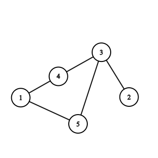

# [CRED](https://cred.club/)

## Details

### Job Status

Full Time (Employment + Internship)

### Criteria

[comment]: # (Any other details go under this. This is a comment)

- This was off-campus

### Compensation

|        | FTE | Internship |
|--------|-----|------------|
| Base   | --  | --         |
| Stocks | --  | --         |
| Bonus  | --  | --         |
| CTC    | --  | --         |

[comment]: # (Details about the rounds go under this comment.)

## Round 1

> 18/11/23

[comment]: # (Summary of the sections and experience below this comment.)

There were 3 coding questions to be done in 90 min.

### Coding Questions

1. **Unique String**: The input is a string consisting of lower case english alphabets. For any character that occurs more than once, it can be deleted.

    Given a string, delete the characters that occur more than once such that the resultant string consists of all the unique characters from the original string as well as is the lexicographically largest one.

    Example:
    ```
    Input: abcba
    Output: cba

    Input: aazbbza
    Output: zba

    Input: aaccb
    Output: acb
    ```

[comment]: # (Add any resources or links or code to this question under this comment.)

```cpp
string solve(string input_string) {
    vector<int> lastOccurance(26, -1);
    vector<bool> used(26, false);
    priority_queue<char> letters;

    int n = input_string.size();

    char ch;
    int idx;
    for (int i = 0; i < n; ++i) {
        ch = input_string[i];
        idx = ch - 'a';
        lastOccurance[idx] = i;
        if (!used[idx]) {
            used[idx] = true;
            letters.push(ch);
        }
    }

    used.clear();
    used.resize(26, false);

    string res;
    for (int i = 0; i < n; ++i) {
        ch = input_string[i];
        idx = ch - 'a';

        if (letters.top() == ch && !used[idx]) {
            res.push_back(ch);
            letters.pop();
            used[idx] = true;
        }
        else if (ch == lastOccurance[idx] && !used[idx]) {
            res.push_back(ch);
            used[idx] = true;
        }
        while (!pq.empty() && used[pq.top() - 'a']) {
            pq.pop();
        }
    }
    return res;
}
```

- This did not pass all the TC's, 9/15

---

2. **Required Strength**: You and your friend are playing an online game, this game, initially starts out with some people with a strength value associated to each player. There are N levels to this game and in each new level, one new player gets added (along with the players from the previous level).

    Your friend has a strategy to defeat the `Rank`<sup>th</sup> player in each round until the end, and you would like to adopt this strategy as well.

    Given the initial array of strength, number of levels N, and the Rank, determine the total strength required to achieve this strategy and defeat the player in each level.

    All the players have unique strength levels.

    Example:
    ```
    [3 5 2] --> Initial players strength
    [4 1 9 8] --> New player that is added at each level

    Level 1 -> 4 is added to the pool
    Level 2 -> 1 is added to the pool
    Level 3 -> 9 is added to the pool
    Level 4 -> 8 is added to the pool

    2 --> Rank

    Answer: 24

    Explanation:
    Rank 2, means that you will be defeating the 2nd strongest player amongst the existing players in each round.

    Round 0: [3 5 2] -> 3
    Round 1: [3 5 2 4] -> 4
    Round 2: [3 5 2 4 1] -> 4 (3 is strength of the 2nd strongest player now)
    Round 3: [3 5 2 4 1 9] -> 5
    Round 4: [3 5 2 4 1 9 8] -> 8

    Strength = 3 + 4 + 4 + 5 + 8 = 24
    ```

[comment]: # (Add any resources or links or code to this question under this comment.)

```cpp
int solve(vector<int>& initial_players, vector<int>& new_players, int rank) {
    priority_queue<int, vector<int>, std::greater<int>> pq(initial_players.begin(), initial_players.end());

    while (pq.size() > rank) {
        pq.pop();
    }

    int res = pq.top();
    for (int i = 0; i < new_players.size(); ++i) {
        pq.push(new_players[i]);
        if (pq.size() > rank) {
            pq.pop();
        }
        res += pq.top();
    }
    return res;
}
```

---

3. **Best Traversal**: There's a city with `g_nodes` number of towns and `m` undirected roads or connections. The connections are determined by two array of size `m`, `g_from` and `g_to`.

    The following code is used to generate a list `B`.
    ```cpp
    void generateB(vector<int>& a, vector<int>& b) {
        for (int i = 0; i < a.size(); ++i) {
            bool found = 0;

            for (int j = 0; j < b.size(); ++j) {
                if (a[i] == b[j]) {
                    found = 1;
                    break;
                }
            }

            if (!found) {
                b.push_back(a[i]);
            }
        }
    }
    ```

    Here, `A` is the traversal you are required to take such that the list `B` generated using the above code generates the lexicographically largest list possible from the given set of connections.

    You are supposed to perform a traversal such that you generate the lexicographically largest list `B`, you are free to perform whatever traversal you like.

    Example:

    | No. | Graph                            | A                                    | B               |
    |-----|----------------------------------|--------------------------------------|-----------------|
    | 1   |  | 5 -> 4 -> 3 -> 2 -> 3 -> 4 -> 1      | [5, 4, 3, 2, 1] |
    | 2   |  | 3 -> 2 -> 3 -> 1                     | [3, 2, 1]       |
    | 3   |  | 4 -> 3 -> 2 -> 1                     | [4, 3, 2, 1]    |
    | 4   |  | 5 -> 3 -> 4 -> 3 -> 2 -> 3 -> 4 -> 1 | [5, 3, 4, 2, 1] |

    A is the optimial traversal to generate list B with the above code.

[comment]: # (Add any resources or links or code to this question under this comment.)

```cpp
void insertToB(vector<int>& a, vector<int>& b, int n) {
    unordered_set<int> vis;
    for (int i = 0; i < a.size(); ++i) {
        if (!vis.count(a[i])) {
            vis.insert(a[i]);
            b.push_back(a[i]);   
        }
        if (b.size() == n) {
            break;
        }
    }
}

vector<int> bestTraversal(int g_nodes, vector<int>& g_from, vector<int>& g_to) {
    int m = g_from.size();
    unordered_map<int, set<int, std::greater<int>>> adj;

    for (int i = 0; i < m; ++i) {
        int src = g_from[i];
        int dst = g_to[i];

        adj[src].insert(dst);
        adj[dst].insert(src);
    }

    unordered_set<int> vis;
    vector<int> a, b;
    priority_queue<pair<int, int>> pq;

    pq.push({g_nodes, -1});
    while (!pq.empty()) {
        while (vis.count(pq.top().first)) {
            pq.pop();
        }
        auto [node, parent] = pq.top();
        pq.pop();

        vis.insert(node);
        a.push_back(node);
        if (vis.size() == g_nodes) {
            break;
        }

        for (const int& neigh: adj[node]) {
            if (node != parent) {
                pq.push({neigh, node});
            }
        }
    }

    insertToB(a, b, g_nodes);
    return b;
}
```

---
