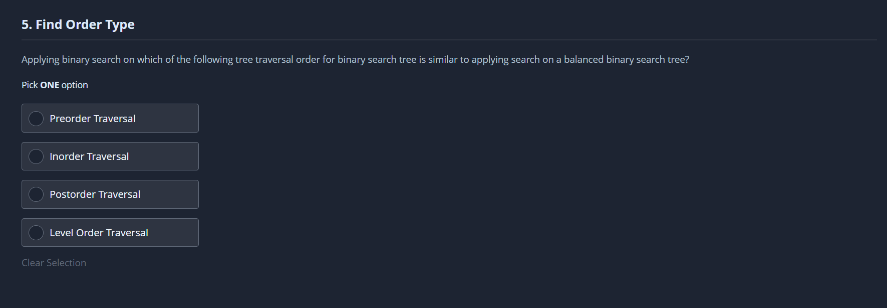

# [Ring Central](https://www.ringcentral.com/)

## Details

### Job Status

Full Time (Employment + Internship Mandatory)

### Criteria

|Study|Cutoff|
|-----|------|
|X|90%|
|XII|90%|
|UG|7.5|

### Compensation

||FTE|Internship|
|--|-----|------|
|Base|20,50,000|--|
|CTC|24,15,000 + 4L sign up|--|

## Round 1

> 06/08/23

Two sections
1. MCQ (15)
2. Coding (2)

### MCQ

### Q1

### Q2

### Q3

### Q4

### Q5

### Q6

### Q7

### Q8

### Q9

### Q10

### Q11

### Q12

### Q13

### Q14

### Q15

### Coding

### Q16

> House Robber on Leetcode

### Q17

---
